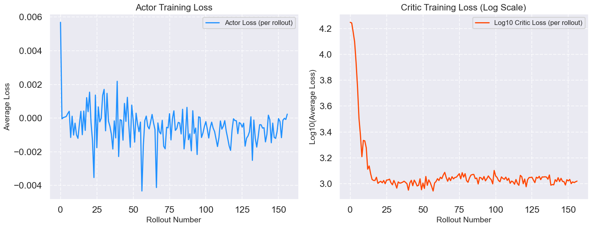

# Reinforcement Learning Rumble

In this repository, we implement various reinforcement learning algorithms from scratch including:
- **Proximal Policy Optimization (PPO)**
- **Soft Actor-Critic (SAC)**
- **Variational Free Energy (VFE)**

#### Goals

1. To become more proficient at translating research papers into code.
2. To gain an in-depth understanding of both the theory and practical implementation.
3. To become familiar with the tricks and techniques required to make RL work in practice.

## Table of Contents

- [Reinforcement Learning Rumble](#reinforcement-learning-rumble)
      - [Goals](#goals)
  - [Table of Contents](#table-of-contents)
  - [Introduction to Reinforcement Learning](#introduction-to-reinforcement-learning)
      - [What is Reinforcement Learning?](#what-is-reinforcement-learning)
      - [How to implement it in code?](#how-to-implement-it-in-code)
  - [PPO](#ppo)
      - [What is PPO?](#what-is-ppo)
      - [How do you connect theory to code?](#how-do-you-connect-theory-to-code)
      - [What are the optimization tricks?](#what-are-the-optimization-tricks)

## Introduction to Reinforcement Learning

### What is Reinforcement Learning?

### How to implement it in code?

## PPO

### What is PPO?

The actor loss is:

$$
 L_{\text{actor}} = -\mathbb{E}_{t} \left[ \log \pi(a_t | s_t) \cdot \hat{A}_t \right]
$$

The total loss (with entropy regularization) is:

$$
L_{\text{total}} = L_{\text{actor}} - \beta \cdot \mathbb{E}_{t}[\mathcal{H}(\pi(\cdot | s_t))]
$$

Where the entropy of a Gaussian policy is:

$$
\mathcal{H}(\mathcal{N}(\mu, \Sigma)) = \frac{1}{2} \ln \left[ (2\pi e)^d \cdot \det(\Sigma) \right]
$$

And, for diagonal $\Sigma$ (vector of variances $\sigma_i^2$):

$$
\mathcal{H} = \frac{d}{2} \left( \ln(2\pi e) + \frac{1}{d} \sum_{i=1}^d \ln \sigma_i^2 \right)
$$

### How do you connect theory to code?

1. When defining the advantage function, fix the value of the value function at the beginning of each episode to avoid unstable moving average computation.
2. Normalize the advantage function to have zero mean and unit variance.

### What are the optimization tricks?

**Current performace:** 

**Improvement steps:** 

#### Tricks

- Learning rate annealing
- Mini batch update
- Entropy regularization  
  - Prevent convergence to suboptimal policy  
  - Encourage the policy to stay stochastic  
  - High entropy = high exploration
- [Gradient clipping](https://pytorch.org/docs/stable/generated/torch.nn.utils.clip_grad_norm_.html)  
  - Exploding gradient can lead to unstable training
- [Approximate KL divergence](http://joschu.net/blog/kl-approx.html)  
  - Use the ratio of the new and old policy to approximate the KL divergence  
  - The ratio is clipped to prevent large updates to the policy
- [Generalized Advantage Estimation (GAE)](https://arxiv.org/abs/1506.02438)  
  - Use a weighted sum of the advantages over multiple time steps to reduce variance  
  - The weights are determined by a hyperparameter lambda  
  - GAE is a trade-off between bias and variance
